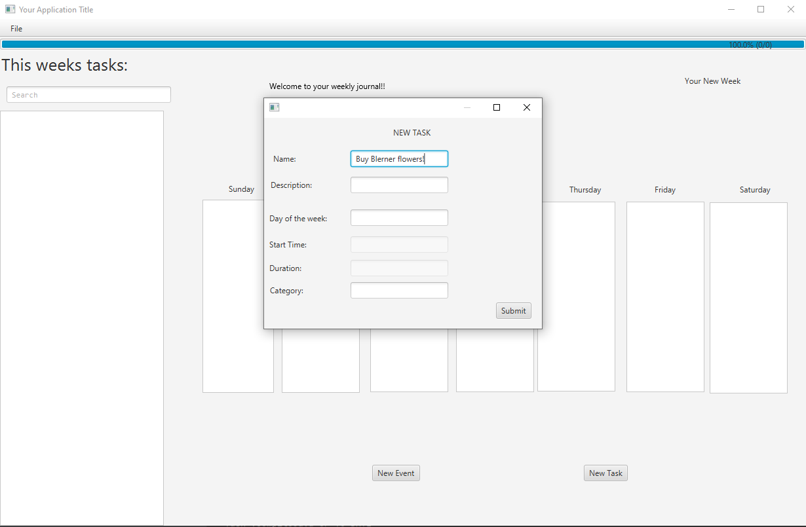

# 3500 PA05 Project Repo

# Plan your week neatly and efficiently!
- Visualization for entire week
- Add and delete events/tasks
  - Categorize them to keep things neat
  - Hashtag shortcut makes categorizations quick
  - Click on an item to expand!
- Search through your week's plans
  - Convenient "Task View" window consolidates everything you need to do
- Manage commitments!
- Save and import journals
- Use other journals as a template
- Updating progress bar visualizes your progress in productivity
- Protect your weekly schedule with a password!!

# SOLID principles:
- S: In the design of the application, the single responsibility principle was heavily valued. 
Each controller exists to perform a single function for the application, so rather than clumping
all the functionality into a single messy class, there are several that work in tandem to provide
a streamlined experience.
- O: The classes of the application-- particularly the model-- were developed to be extended, not 
modified. An example of such an occurrence was in the representation of a planned week. Rather than
modifying the previous data container of a PlannedDay, another class extending it was created to
hold the newly required information.
- L: The fields of the abstract class for a PlannedItem in the model were carefully chosen to ensure
Liskov Substitution Principle applied. Each child of the class can do all the functionality of 
a PlannedItem **correctly** and **without any outstanding issues**, on top of the specific functionality
of the child in question.
- I: While not many interfaces were used in the progress, it was taken under careful consideration which
functionalities should be delegated to which interface/abstract class. Keeping such functionalities segregated
ensured the created code was much more flexible and easier to extend.
- D: The object hierarchies of the application only extend upon abstract classes and interfaces. There is no
occurrence of any class extending a concrete class. This also helps ensure the "open for extension,
closed for modification" aspect of the design.

# Extension of the program - filter by category
Another considered feature of the application was the ability to filter tasks and events by category.
This could be accomplished by adding a selection box to the GUI that maintains a list of all the unique
categories present in the current data (this would be updated every time the update() method is called.)
Then, when a category is selected from the box, every item that does not fall under the selected category
would be hidden from the user. To show all the items again, there could either be a "reset view" button,
or the user could simply click a blank option from the box.